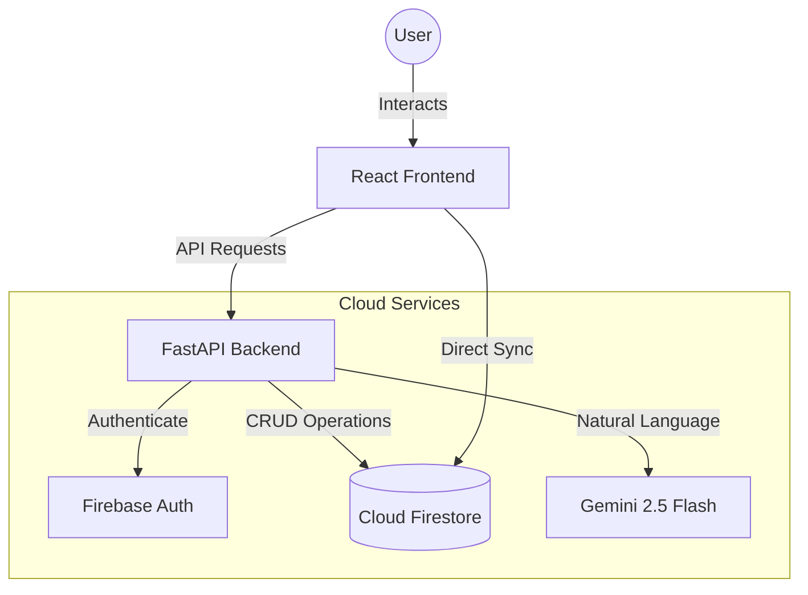

# D-Expense AI: Intelligent Personal Finance Tracker

[](https://fastapi.tiangolo.com/)
[](https://reactjs.org/)
[](https://firebase.google.com/)
[](https://aistudio.google.com/)

**D-Expense AI** is a sophisticated personal finance management system integrated with advanced Artificial Intelligence. Built as part of **Lab 2: API & Firebase**, this project demonstrates a seamless integration between a modern web frontend, a high-performance Python backend, and Google's cutting-edge LLM technology.

---

## 🏛️ System Architecture

The application follows a **Decoupled Client-Server Architecture**, ensuring scalability and clear separation of concerns.



---

## ✨ Key Features

### 1. 🤖 Intelligent AI Assistant
- **Engine**: Powered by **Gemini 2.5 Flash**.
- **Capabilities**: Automatically parses natural language (e.g., "Lunch 50k") into structured financial data.
- **Personality**: Features a unique, witty "GenZ" persona that provides humorous financial advice and "sarcastic" reminders.

### 2. 📊 Smart Financial Dashboard
- **Real-time Sync**: AI-processed transactions reflect immediately on the dashboard.
- **Monthly Management**: Robust filtering by Month/Year to track spending habits over time.
- **Data Visualization**: Interactive charts for categorical expense distribution.

### 3. 🔒 Secure Authentication
- **Provider**: Firebase Authentication.
- **Security**: Stateless session management with secure backend validation.

### 4. 🎨 Premium UI/UX
- **Theme**: High-contrast Dark Mode with Glassmorphism effects.
- **Interactions**: Custom branded modals and smooth micro-animations.

---

## 🛠️ Tech Stack

| Layer | Technology |
| :--- | :--- |
| **Frontend** | React 18, Vite, Context API, Vanilla CSS |
| **Backend** | Python 3.9+, FastAPI, Pydantic, Uvicorn |
| **Database** | Google Cloud Firestore (NoSQL) |
| **Authentication** | Firebase Auth (Google & Email/Password) |
| **Artificial Intelligence** | Google Generative AI (Gemini 2.5 Flash) |

---

## 📂 Project Structure

```text
expense-tracker/
├── backend/                # FastAPI Application
│   ├── routers/            # API Endpoints (Auth, Expenses, Chat)
│   ├── services/           # Business Logic (Firestore, Gemini)
│   ├── schemas/            # Pydantic Data Models
│   ├── main.py             # Entry Point & Health Checks
│   └── .env                # Environment Variables (Secrets)
├── frontend/               # React Application
│   ├── src/
│   │   ├── components/     # UI Components (Custom Modal, Charts)
│   │   ├── context/        # State Management (AppContext)
│   │   ├── services/       # API Integration (Axios/AuthFetch)
│   │   └── pages/          # Dashboard & Authentication Pages
│   └── .env                # Frontend Config
└── README.md
```

---

## 🚀 Installation & Setup

### Prerequisites

- Python 3.9+
- Node.js 18+
- A Firebase Project (with Authentication & Firestore enabled)
- A Google AI Studio API Key ([Get one here](https://aistudio.google.com/))

### 1. Environment Configuration

#### Backend (`backend/.env`)
```env
GEMINI_API_KEY=your_gemini_api_key_here
GOOGLE_APPLICATION_CREDENTIALS=serviceAccountKey.json
ALLOWED_ORIGINS=http://localhost:5173
```

#### Frontend Environment (`frontend/.env`)
Create a `.env` file inside the `frontend/` directory with your Firebase project config:
```env
VITE_API_URL=http://localhost:8000
VITE_FIREBASE_API_KEY=your_firebase_api_key
VITE_FIREBASE_AUTH_DOMAIN=your_project.firebaseapp.com
VITE_FIREBASE_PROJECT_ID=your_project_id
VITE_FIREBASE_STORAGE_BUCKET=your_project.appspot.com
VITE_FIREBASE_MESSAGING_SENDER_ID=your_sender_id
VITE_FIREBASE_APP_ID=your_app_id
```

#### Firebase Service Account
Place your `serviceAccountKey.json` file (downloaded from Firebase Console → Project Settings → Service accounts) into the `backend/` directory.

### 2. Running the Backend
```bash
# From the project root (expense-tracker/)
source .venv/bin/activate        # macOS/Linux
# .venv\Scripts\activate         # Windows

cd backend
pip install -r requirements.txt
uvicorn main:app --reload --port 8000
```
> The API will be available at `http://localhost:8000`
> Swagger UI (API Docs): `http://localhost:8000/docs`

### 3. Running the Frontend
```bash
# Open a new terminal, from the project root (expense-tracker/)
cd frontend
npm install
npm run dev
```
> The app will be available at `http://localhost:5173`

---

## 📡 API Documentation

| Method | Endpoint | Description |
| :--- | :--- | :--- |
| `GET` | `/` | Root health check & API info |
| `GET` | `/health` | Server status check |
| `POST` | `/chat/` | Send message to AI Assistant |
| `GET` | `/expenses/` | List transactions with Month/Year filter |
| `POST` | `/expenses/` | Create new manual transaction |
| `GET` | `/expenses/summary` | Get financial report summary |

> 📖 Full interactive API documentation is available at `/docs` (Swagger UI) when the backend is running.

---

## 📋 Lab 2 Requirements Compliance

| Requirement | Status | Implementation |
| :--- | :--- | :--- |
| Separate FE & BE | ✅ Done | React & FastAPI running on different ports/origins |
| FastAPI Framework | ✅ Done | Core backend engine |
| Health Checks (`/`, `/health`) | ✅ Done | Implemented in `main.py` |
| Firebase Integration | ✅ Done | Firestore for data, Auth for security |
| AI Integration | ✅ Done | Gemini 2.5 Flash for smart data entry |
| GitHub Repository | ✅ Done | Properly initialized with `.gitignore` |

---

## 🎬 Video Demo

[](https://www.youtube.com/watch?v=THAY_VIDEO_ID_VAO_DAY)

> 👆 Click vào ảnh trên để xem video demo trên YouTube.

---

## 👨‍💻 Author
**Nguyễn Đức Duy** - Student ID: 24120294
*University of Science - VNUHCM*
